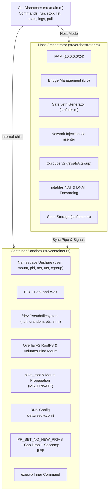
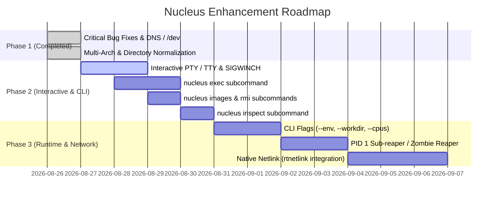

# Nucleus: Codebase Analysis, Critical Bug Fixes & Enhancement Roadmap ⚛️

> **Historical document.** This analysis describes the codebase as of the
> `enhancements` branch (v0.2.0) and is kept for reference only. Several details
> it describes as current are no longer true: the subnet is no longer hardcoded to
> `10.0.0.0/24`, the CLI now implements `exec`, `inspect`, `ps`, `images`, `rmi` and
> `rm`, and the `internal-child` flow now records and signals the container's init
> PID. See the [changelog](../CHANGELOG.md) for what changed in 0.3.0 and the
> [README](../README.md) for current behaviour.

## 1. Executive Summary

**Nucleus** is a minimalist, high-performance container engine written in pure Rust. It implements zero-daemon process isolation utilizing Linux kernel primitives: Namespaces (`user`, `pid`, `mount`, `net`, `uts`, `cgroup`), Cgroups v2, OverlayFS, `pivot_root`, and host-driven `nsenter` network configuration.

This document serves as a persistent record of the codebase architecture, recently resolved critical correctness/security issues, and the strategic feature roadmap.

---

## 2. Architecture & Subsystem Map

---

## 3. Resolved Critical Bugs & Correctness Enhancements

The following critical defects have been resolved across the codebase:

### 🔴 1. Broken Container DNS Resolution (`/etc/resolv.conf`)
* **Problem:** If `/etc/resolv.conf` existed, it was emptied to 0 bytes and bind-mounted onto itself without nameservers.
* **Resolution:** [container.rs](file:///home/sumant/Work/Nucleus/src/container.rs#L254-L260) now provisions standard DNS servers (`1.1.1.1`, `8.8.8.8`, `8.8.4.4`), enabling internet and domain name resolution for containerized processes (`apk`, `apt`, `curl`, `ping`).

### 🔴 2. Missing `/dev` Pseudofilesystem & Standard Device Nodes
* **Problem:** The container previously mounted `/proc` and `/sys`, but omitted `/dev`, causing runtimes (Python, OpenSSL, curl) to fail when opening `/dev/null` or `/dev/urandom`.
* **Resolution:** [container.rs](file:///home/sumant/Work/Nucleus/src/container.rs#L206-L252) now mounts a `tmpfs` at `/dev`, bind-mounts standard devices (`null`, `zero`, `full`, `random`, `urandom`, `tty`), creates `/dev/pts` (`devpts`) and `/dev/shm` (`tmpfs`), and establishes standard symlinks (`/dev/fd`, `/dev/stdin`, `/dev/stdout`, `/dev/stderr`, `/dev/ptmx`).

### 🔴 3. Hardcoded `x86_64` URLs Breaking ARM64 (`aarch64`)
* **Problem:** Image URLs were hardcoded to `x86_64` / `amd64`, leading to `ENOEXEC` (Exec format error) on ARM64 hosts.
* **Resolution:** [image.rs](file:///home/sumant/Work/Nucleus/src/image.rs#L34-L88) now uses runtime architecture detection ([`get_target_arch()`](file:///home/sumant/Work/Nucleus/src/utils.rs#L50)) to dynamically pull matching rootfs images for `x86_64`, `aarch64`, and `armhf`.

### 🔴 4. Arbitrary Relative `CWD` Storage Paths
* **Problem:** Images and container state were stored in `./images`, `./cached_images`, and `./temp` relative to the current working directory, preventing images pulled in one directory from being used in another.
* **Resolution:** Implemented standardized directory resolution in [utils.rs](file:///home/sumant/Work/Nucleus/src/utils.rs#L21-L48) and [state.rs](file:///home/sumant/Work/Nucleus/src/state.rs):
  - Data directory: `/var/lib/nucleus` (or `$XDG_DATA_HOME/nucleus`)
  - Runtime directory: `/run/nucleus` (or `$XDG_RUNTIME_DIR/nucleus`)
  - Log directory: `/var/log/nucleus` (or `$XDG_STATE_HOME/nucleus/logs`)
  - Retained fallback scanning for local workspace backward-compatibility.

### 🔴 5. Host `iptables` Rule Leaks
* **Problem:** Starting containers unconditionally appended (`-A`) `MASQUERADE` and `FORWARD` rules, leaking duplicate rules into the host kernel firewall table.
* **Resolution:** [orchestrator.rs](file:///home/sumant/Work/Nucleus/src/orchestrator.rs#L195-L248) now checks (`-C`) before appending (`-A`) firewall rules, ensuring idempotence.

### 🔴 6. `veth` Interface Collision on 12-Character Truncation
* **Problem:** Containers sharing the first 12 characters of their name caused `vh-` interface collisions.
* **Resolution:** [utils.rs](file:///home/sumant/Work/Nucleus/src/utils.rs#L60-L77) now generates deterministic, collision-free interface names using FNV-1a hashing within Linux's 15-character `IFNAMSIZ` limit (e.g. `vh-myservi-a3f1`).

### 🔴 7. Incomplete Detached (`--detach`) Execution
* **Problem:** Orchestrator blocked on `child.wait()` even when `--detach` was passed.
* **Resolution:** [orchestrator.rs](file:///home/sumant/Work/Nucleus/src/orchestrator.rs#L265-L272) configures all networking, state, and cgroups, signals the child, and returns immediately with container PID/name.

### 🔴 8. Security Hardening (`PR_SET_NO_NEW_PRIVS`)
* **Problem:** Setuid binaries could potentially escalate privileges inside unprivileged containers.
* **Resolution:** [container.rs](file:///home/sumant/Work/Nucleus/src/container.rs#L267-L274) invokes `libc::prctl(PR_SET_NO_NEW_PRIVS, 1, 0, 0, 0)` prior to dropping capabilities and entering seccomp filters.

### 🔴 9. Unified Resource Teardown
* **Resolution:** Added [`teardown_container`](file:///home/sumant/Work/Nucleus/src/orchestrator.rs#L347) to ensure `nucleus stop <name>` and process exit events cleanly remove veth pairs, iptables rules, cgroups, OverlayFS mounts, and state files.

---

## 4. File-by-File Change Matrix

| File | Key Changes |
| :--- | :--- |
| [`src/utils.rs`](file:///home/sumant/Work/Nucleus/src/utils.rs) | Central path resolvers, multi-arch detector (`get_target_arch`), safe veth generator (`generate_veth_names`), and expanded memory unit parser (`GiB`, `GB`, `MiB`, `MB`, `KiB`, `KB`). |
| [`src/image.rs`](file:///home/sumant/Work/Nucleus/src/image.rs) | Multi-arch mapping (`alpine`, `ubuntu`, `debian`), image path resolution hierarchy, centralized caching. |
| [`src/state.rs`](file:///home/sumant/Work/Nucleus/src/state.rs) | Uses secure `/run/nucleus/state` runtime directory with backward-compatible legacy lookup. |
| [`src/container.rs`](file:///home/sumant/Work/Nucleus/src/container.rs) | DNS fix (`/etc/resolv.conf`), full `/dev` tmpfs with nodes/pts/shm/symlinks, central image lookup, `PR_SET_NO_NEW_PRIVS`. |
| [`src/orchestrator.rs`](file:///home/sumant/Work/Nucleus/src/orchestrator.rs) | Bridge check deduplication, iptables rule checking, detached mode non-blocking return, `teardown_container` cleanup function. |
| [`src/main.rs`](file:///home/sumant/Work/Nucleus/src/main.rs) | CLI dispatch with `NucleusArgs`, centralized log directory lookup, integrated `stop` command cleanup. |
| [`src/stats.rs`](file:///home/sumant/Work/Nucleus/src/stats.rs) | Continuous delta CPU calculation without blocking `100ms` sleeps during streaming. |
| [`src/args.rs`](file:///home/sumant/Work/Nucleus/src/args.rs) | Renamed struct to `NucleusArgs` with `OxideArgs` backward-compatibility alias. |
| [`tests/integration_tests.rs`](file:///home/sumant/Work/Nucleus/tests/integration_tests.rs) | Updated state file path assertions to support runtime directory locations. |

---

## 5. Enhancement Roadmap (Next Milestones)

### Phase 2: Interactive CLI & Subcommands
1. **Interactive PTY / TTY Allocation (`-i`, `-t`)**: Allocate pseudo-terminal master/slave pair and set host terminal into raw mode (`termios`) with `SIGWINCH` forwarding for full terminal fidelity in programs like `vim` or `htop`.
2. **`nucleus exec <name> <cmd>`**: Enter running containers using `setns()` on `/proc/<pid>/ns/{mnt,net,pid,uts,ipc}`.
3. **`nucleus inspect <name>`**: Provide detailed JSON output describing IP, mounts, PID, status, resource limits, and network interfaces.
4. **`nucleus images` & `nucleus rmi`**: Manage cached and extracted rootfs layers.

### Phase 3: Advanced Controls & Performance
1. **Container Options**: Add `--env KEY=VAL`, `--env-file`, `--workdir`, and granular `--cpus` throttling.
2. **Built-in PID 1 Sub-Reaper**: Provide automatic zombie process reaping for processes spawned inside the container.
3. **Native Netlink Migration**: Replace shell calls (`ip`, `iptables`) with pure Rust `rtnetlink` / `netlink-packet-route` for sub-5ms container startup times.
